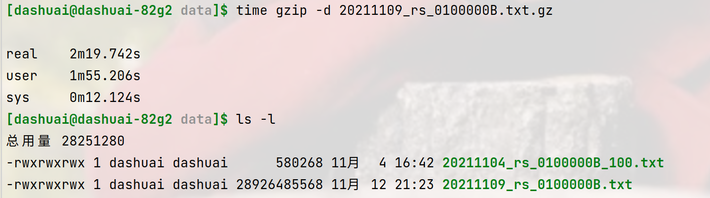

## 2021.11.17

|test_in.txt|test_out.txt|test_out.txt.gz|
|---|---|---|
|580268|253703|85656|

> 第一步，将defaultConfig.txt里的模式串替换，将源文件题解减小一多半，再用gzip（第二步）可以比直接用gzip好一点

ToDo
- 速度太慢，std::string花费时间太多
- 不是流式压缩，大文件肯定无法直接读入内存。struct Buffer;
- 最后必须是一步完整压缩/解压
- 考虑将数字（非“”内的）单独压缩
- 考虑正则匹配引擎，`\{"x":-?[0-9]*,"y":-?[0-9]*,"z":-?[0-9]*\}`这样的可以用一个占位符和三个整数来替代。test_in.txt里有9485个。
- Log函数。

## 11.18

done
- Log
- Cmake
- move std::string
- Buffer

## 11.19
|test_in.txt|test_out.txt|test_in.txt.gz|time myzip test_in.txt| time gzip test_in.txt|
|---|---|---|---|---|
|990777330|50839839|177155091|9s|23s|

# 11.20
- 添加了huffman编码，速度降低，压缩率提高。
- 一个bug：int(char)时，这个char有符号，会进行符号位扩展。int(char(-125))会是一个负数。

|test_in4.txt|time myzip|time myunzip|test_out.txt|压缩率|
|---|---|---|---|---|
|523582020|18.572s |20.100s|124765778|23.83%|

- 唉，速度慢。压缩率低。到底还玩不玩了？？？？

# 11.21

> 今天过生日！屁事没干成
> 

- cmp -i a.txt b.txt 现实a、 b文件差异的字节位置和内容